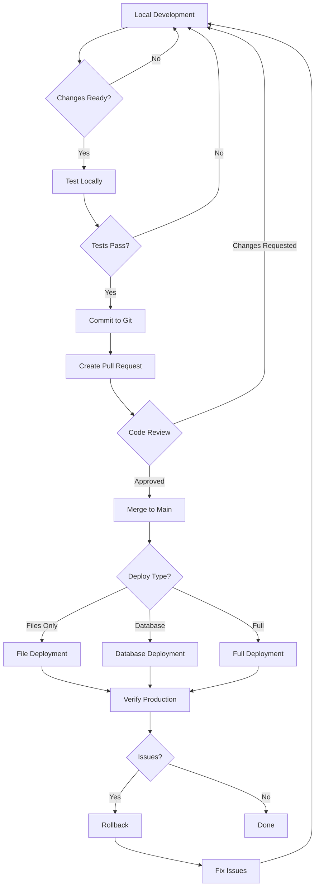

# MGRNZ Local Development & Deployment Guide

**Complete guide for local WordPress development with production deployment capabilities**

---

## Table of Contents

1. [Quick Start](#quick-start)
2. [Architecture Overview](#architecture-overview)
3. [Initial Setup](#initial-setup)
4. [Daily Development Workflow](#daily-development-workflow)
5. [Deployment Workflows](#deployment-workflows)
6. [Troubleshooting](#troubleshooting)
7. [Best Practices](#best-practices)
8. [Reference Documentation](#reference-documentation)

---

## Quick Start

### Prerequisites Checklist

- [ ] PHP 8.2+ installed
- [ ] MySQL 8.0+ or MariaDB 10.6+ installed
- [ ] Local WordPress environment (Local by Flywheel, XAMPP, or Docker)
- [ ] WP-CLI installed locally and on production
- [ ] SSH access to production server
- [ ] Git installed
- [ ] PowerShell 5.1+ (Windows)

### 5-Minute Setup

```powershell
# 1. Clone repository
git clone https://github.com/yourusername/mgrnz-blog.git
cd mgrnz-blog

# 2. Install PHP dependencies
composer install

# 3. Configure local environment
# Edit .env.local with your local database credentials

# 4. Set up WordPress configuration
copy wp-config-local.php "C:\Local Sites\mgrnz\app\public\wp-config.php"

# 5. Pull production data (optional)
.\scripts\pull-from-production.ps1

# 6. Access your local site
# http://mgrnz.local (or your configured local URL)
```

**Done!** You're ready to develop locally.

---

## Architecture Overview

### System Components

```
┌─────────────────────────────────────────────────────────────┐
│                    Developer Workstation                     │
│                                                              │
│  ┌────────────────┐         ┌──────────────────┐           │
│  │ Local WordPress│◄────────┤  WP-CLI Tools    │           │
│  │   + Database   │         └──────────────────┘           │
│  └────────┬───────┘                                         │
│           │                                                  │
│           │         ┌──────────────────┐                    │
│           └────────►│ Deployment       │                    │
│                     │ Scripts          │                    │
│                     └────────┬─────────┘                    │
│                              │                               │
└──────────────────────────────┼───────────────────────────────┘
                               │
                               │ SFTP/SSH
                               │
                ┌──────────────▼──────────────┐
                │                             │
                │   Spaceship Hosting         │
                │   (mgrnz.com)               │
                │                             │
                │  ┌──────────────────────┐   │
                │  │ WordPress Production │   │
                │  │    + MySQL DB        │   │
                │  └──────────┬───────────┘   │
                │             │                │
                └─────────────┼────────────────┘
                              │
                              │ Webhooks
                              │
                ┌─────────────▼────────────────┐
                │                              │
                │   Supabase Edge Functions    │
                │   - ai-intake                │
                │   - wp-sync                  │
                │   - ml-to-hugo               │
                │   - mailerlite-webhook       │
                │                              │
                └──────────────────────────────┘
```

### Environment Separation

| Aspect | Local Environment | Production Environment |
|--------|-------------------|------------------------|
| **Domain** | `http://mgrnz.local` | `https://mgrnz.com` |
| **Database** | `mgrnz_local` | `MGRNZ` |
| **Debug Mode** | Enabled | Disabled |
| **Supabase** | Local or test project | Production project |
| **API Keys** | Test credentials | Production credentials |
| **File Editing** | Allowed in admin | Disabled in admin |

---

## Initial Setup

### Step 1: Install Local WordPress Environment

Choose one of the following options:

#### Option A: Local by Flywheel (Recommended for Windows)

1. Download and install [Local by Flywheel](https://localwp.com/)
2. Create a new site:
   - Site name: `mgrnz`
   - Local domain: `mgrnz.local`
   - PHP version: 8.2+
   - Web server: Nginx or Apache
   - Database: MySQL 8.0+

#### Option B: Docker

```powershell
docker run -d -p 8080:80 --name mgrnz-local `
  -e WORDPRESS_DB_HOST=mysql `
  -e WORDPRESS_DB_NAME=mgrnz_local `
  -e WORDPRESS_DB_USER=root `
  -e WORDPRESS_DB_PASSWORD=root `
  wordpress:latest
```

#### Option C: XAMPP

1. Download and install [XAMPP](https://www.apachefriends.org/)
2. Start Apache and MySQL
3. Download WordPress and extract to `htdocs/mgrnz`

### Step 2: Configure Environment Variables

1. **Edit `.env.local`** with your local settings:

```env
# Database Configuration
DB_NAME=mgrnz_local
DB_USER=root
DB_PASSWORD=root
DB_HOST=localhost

# WordPress URLs
WP_HOME=http://mgrnz.local
WP_SITEURL=http://mgrnz.local

# Debug Settings
WP_DEBUG=true
WP_DEBUG_LOG=true
WP_DEBUG_DISPLAY=true

# Supabase (use local or test project)
SUPABASE_URL=http://localhost:54321
MGRNZ_WEBHOOK_URL=http://localhost:54321/functions/v1/wp-sync
MGRNZ_WEBHOOK_SECRET=local-test-secret

# Third-party (use test credentials)
MAILERLITE_API_KEY=test-key-local
ML_INTAKE_GROUP_ID=test-group
```

2. **Install PHP dependencies:**

```powershell
composer install
```

3. **Copy WordPress configuration:**

```powershell
# For Local by Flywheel
copy wp-config-local.php "C:\Local Sites\mgrnz\app\public\wp-config.php"

# Or create a symlink (requires admin privileges)
mklink "C:\Local Sites\mgrnz\app\public\wp-config.php" wp-config-local.php
```

### Step 3: Set Up Deployment Credentials

1. **Copy the credentials template:**

```powershell
copy .deploy-credentials.json.example .deploy-credentials.json
```

2. **Edit `.deploy-credentials.json`** with your server details:

```json
{
  "production": {
    "host": "mgrnz.com",
    "port": 22,
    "username": "your-ssh-username",
    "password": "your-password-or-leave-empty",
    "privateKeyPath": "",
    "remotePath": "/home/username/public_html",
    "useKeyAuth": false
  }
}
```

3. **Test the connection:**

```powershell
.\scripts\test-connection.ps1 -Environment production
```

### Step 4: Pull Production Data (Optional)

To work with production content locally:

```powershell
.\scripts\pull-from-production.ps1
```

This will:
- Export production database
- Import to local environment
- Replace production URLs with local URLs
- Download themes, plugins, and uploads (optional)

### Step 5: Set Up Supabase Local Testing (Optional)

For testing Supabase edge functions locally:

**Quick setup:**
```powershell
# Install Supabase CLI
npm install -g supabase

# Start local Supabase (requires Docker)
supabase start

# Deploy functions
supabase functions deploy

# Serve functions
supabase functions serve
```

**See:** [supabase/QUICK_START.md](supabase/QUICK_START.md) for detailed instructions.

---

## Daily Development Workflow

### Starting Your Day

```powershell
# 1. Start local WordPress
# (Local by Flywheel, XAMPP, or Docker)

# 2. Start Supabase (if testing edge functions)
supabase start
supabase functions serve

# 3. Access your local site
# http://mgrnz.local
```

### Making Changes

```powershell
# 1. Create a feature branch
git checkout -b feature/my-new-feature

# 2. Make your changes
# - Edit theme files in wp-content/themes/
# - Modify plugins in wp-content/plugins/
# - Update mu-plugins in wp-content/mu-plugins/

# 3. Test locally
# - Verify changes in browser
# - Check for errors in debug.log
# - Test edge function integrations

# 4. Commit your changes
git add .
git commit -m "feat: description of changes"
git push origin feature/my-new-feature
```

### Testing Changes

```powershell
# Test WordPress functionality
# - Create/edit posts
# - Test admin features
# - Verify webhooks trigger

# Test Supabase integration (if applicable)
.\supabase\test-edge-functions.ps1 -Function wp-sync -Environment local

# View edge function logs
supabase functions logs wp-sync --follow
```

### Syncing with Production

```powershell
# Pull latest production content (weekly or as needed)
.\scripts\pull-from-production.ps1

# Options:
# -SkipDatabase    # Only pull files
# -SkipFiles       # Only pull database
# -SkipUploads     # Skip media files
```

### Ending Your Day

```powershell
# Stop Supabase (if running)
supabase stop

# Commit any uncommitted work
git add .
git commit -m "wip: work in progress"
git push origin feature/my-new-feature

# Stop local WordPress
# (Local by Flywheel, XAMPP, or Docker)
```

---

## Deployment Workflows

### Workflow Diagram



### File Deployment (Most Common)

Deploy code changes (themes, plugins, mu-plugins) to production:

```powershell
# 1. Verify changes are committed
git status

# 2. Run deployment script
.\scripts\deploy.ps1 -Environment production

# The script will:
# - Run pre-deployment checks
# - Create production backup
# - Display changes to be deployed
# - Ask for confirmation
# - Upload files via SFTP
# - Verify deployment
```

**What gets deployed:**
- Theme files (`wp-content/themes/`)
- Plugin files (`wp-content/plugins/`)
- Must-use plugins (`wp-content/mu-plugins/`)

**What doesn't get deployed:**
- `wp-config.php` (environment-specific)
- `.env` files (environment-specific)
- `wp-content/uploads/` (unless explicitly included)
- `wp-content/cache/` (excluded)

### Database Deployment (Rare)

⚠️ **WARNING:** Database deployment overwrites production data. Use with extreme caution!

```powershell
# Only use when you have database schema changes or critical data updates

# 1. Backup production first
.\scripts\db-pull.ps1  # Creates local backup of production

# 2. Push database to production
.\scripts\db-push.ps1

# The script will:
# - Show multiple warnings
# - Require explicit confirmation
# - Create production backup
# - Export local database
# - Replace local URLs with production URLs
# - Upload and import to production
```

**When to use database deployment:**
- New database tables or columns
- Critical data corrections
- Plugin activation that modifies database

**When NOT to use:**
- Content changes (use WordPress admin instead)
- Regular development (deploy code, not data)
- User-generated content (will be overwritten)

### Selective Deployment

Deploy specific components:

```powershell
# Deploy only themes
.\scripts\file-push.ps1 -Environment production -ThemesOnly

# Deploy only plugins
.\scripts\file-push.ps1 -Environment production -PluginsOnly

# Deploy only mu-plugins
.\scripts\file-push.ps1 -Environment production -MuPluginsOnly

# Dry run (see what would be deployed)
.\scripts\deploy.ps1 -Environment production -DryRun
```

### Rollback Procedure

If deployment causes issues:

```powershell
# 1. List available backups
.\scripts\rollback.ps1 -ListBackups

# 2. Restore from latest backup
.\scripts\rollback.ps1 -BackupTimestamp "latest"

# 3. Or restore from specific backup
.\scripts\rollback.ps1 -BackupTimestamp "20251118-143022"

# Options:
# -FilesOnly       # Only restore files
# -DatabaseOnly    # Only restore database
# -Force           # Skip confirmation prompts
```

### Emergency Procedures

**Production site is down:**

```powershell
# 1. Immediately rollback to last known good state
.\scripts\rollback.ps1 -BackupTimestamp "latest" -Force

# 2. Verify site is accessible
# Visit https://mgrnz.com

# 3. Investigate issue locally
# Review logs, test changes, fix bugs

# 4. Redeploy when ready
.\scripts\deploy.ps1 -Environment production
```

**Database corruption:**

```powershell
# 1. Restore database from backup
.\scripts\rollback.ps1 -BackupTimestamp "latest" -DatabaseOnly

# 2. Verify database integrity
ssh user@mgrnz.com "cd /path/to/wordpress && wp db check"

# 3. Test site functionality
```

---

## Troubleshooting

### Common Issues

#### Local WordPress Not Loading

**Symptoms:**
- Site shows "Error establishing database connection"
- Blank white screen
- 500 Internal Server Error

**Solutions:**

1. **Check database is running:**
   ```powershell
   # For Local by Flywheel: Check app status
   # For XAMPP: Start MySQL in control panel
   # For Docker: docker ps
   ```

2. **Verify database credentials:**
   ```powershell
   # Check .env.local has correct values
   cat .env.local | Select-String "DB_"
   ```

3. **Test database connection:**
   ```powershell
   php test-environment.php
   ```

4. **Check WordPress debug log:**
   ```powershell
   tail -f wp-content/debug.log
   ```

#### URL Issues After Database Pull

**Symptoms:**
- Links point to production URLs
- Images don't load
- Admin redirects to production

**Solutions:**

1. **Run search-replace:**
   ```powershell
   cd wp
   wp search-replace 'https://mgrnz.com' 'http://mgrnz.local' --all-tables
   ```

2. **Clear WordPress cache:**
   ```powershell
   wp cache flush
   ```

3. **Update permalink structure:**
   ```powershell
   wp rewrite flush
   ```

#### Deployment Connection Failures

**Symptoms:**
- "Cannot connect to production server"
- "Connection timed out"
- "Authentication failed"

**Solutions:**

1. **Test SSH connection manually:**
   ```powershell
   ssh username@mgrnz.com
   ```

2. **Verify credentials:**
   ```powershell
   .\scripts\test-connection.ps1 -Environment production
   ```

3. **Check firewall settings:**
   - Ensure port 22 is open
   - Verify IP is not blocked

4. **Try password authentication:**
   ```json
   // In .deploy-credentials.json
   {
     "useKeyAuth": false,
     "password": "your-password"
   }
   ```

#### Supabase Edge Functions Not Working

**Symptoms:**
- Webhooks not triggering
- 404 errors on function endpoints
- Functions timing out

**Solutions:**

1. **Check Supabase is running:**
   ```powershell
   supabase status
   ```

2. **Verify Docker is running:**
   ```powershell
   docker ps
   ```

3. **Check function logs:**
   ```powershell
   supabase functions logs wp-sync
   ```

4. **Test function directly:**
   ```powershell
   .\supabase\test-edge-functions.ps1 -Function wp-sync -Environment local
   ```

5. **Verify environment variables:**
   ```powershell
   cat supabase\.env.local
   ```

#### File Permissions Issues

**Symptoms:**
- Cannot upload files in WordPress admin
- Cannot update plugins/themes
- "Permission denied" errors

**Solutions:**

1. **Windows (Local by Flywheel):**
   - Right-click `wp-content` folder
   - Properties → Security → Edit
   - Give your user full control

2. **Linux/Mac:**
   ```bash
   chmod -R 755 wp-content
   chown -R www-data:www-data wp-content
   ```

3. **Docker:**
   ```bash
   docker exec -it mgrnz-local chown -R www-data:www-data /var/www/html/wp-content
   ```

### Getting Help

1. **Check log files:**
   ```powershell
   # WordPress debug log
   tail -f wp-content/debug.log
   
   # Deployment logs
   Get-Content logs\deploy-*.log | Select-Object -Last 50
   
   # Supabase logs
   supabase functions logs
   ```

2. **Review documentation:**
   - [Environment Setup Guide](ENVIRONMENT_SETUP.md)
   - [Scripts README](scripts/README.md)
   - [Supabase Testing Guide](supabase/TESTING_EDGE_FUNCTIONS.md)

3. **Test individual components:**
   ```powershell
   # Test environment configuration
   php test-environment.php
   
   # Test SFTP connection
   .\scripts\test-connection.ps1 -Environment production
   
   # Test edge functions
   .\supabase\test-edge-functions.ps1 -Function all -Environment local
   ```

---

## Best Practices

### Development Best Practices

#### 1. Always Work in Feature Branches

```powershell
# Create feature branch
git checkout -b feature/descriptive-name

# Make changes and commit frequently
git add .
git commit -m "feat: clear description"

# Push to remote
git push origin feature/descriptive-name

# Create pull request for review
```

#### 2. Test Locally Before Deploying

- ✅ Test all functionality in local environment
- ✅ Check for PHP errors in debug.log
- ✅ Verify database queries are optimized
- ✅ Test on different browsers
- ✅ Check mobile responsiveness
- ✅ Test edge function integrations

#### 3. Use Meaningful Commit Messages

```powershell
# Good commit messages
git commit -m "feat: add user profile page"
git commit -m "fix: resolve database connection timeout"
git commit -m "refactor: optimize post query performance"
git commit -m "docs: update deployment guide"

# Bad commit messages
git commit -m "updates"
git commit -m "fix stuff"
git commit -m "wip"
```

#### 4. Keep Local Environment in Sync

```powershell
# Pull production data weekly
.\scripts\pull-from-production.ps1

# Or just pull database
.\scripts\db-pull.ps1

# Keep git branches updated
git checkout main
git pull origin main
git checkout feature/my-feature
git rebase main
```

### Deployment Best Practices

#### 1. Deploy Files, Not Database

**Preferred workflow:**
- Develop and test locally
- Deploy code changes (themes, plugins)
- Make content changes in production WordPress admin

**Avoid:**
- Deploying database from local to production
- Overwriting production content with local data

#### 2. Always Create Backups

```powershell
# Backups are created automatically by default
# But you can create manual backups:

# Backup production database
ssh user@mgrnz.com "cd /path/to/wordpress && wp db export backups/manual-backup-$(date +%Y%m%d).sql"

# Backup production files
.\scripts\file-pull.ps1 -Environment production
```

#### 3. Use Dry Run Mode

```powershell
# Test deployment without making changes
.\scripts\deploy.ps1 -Environment production -DryRun

# Review what would be deployed
# Then run actual deployment
.\scripts\deploy.ps1 -Environment production
```

#### 4. Verify After Deployment

```powershell
# After deployment, always:
# 1. Visit production site
# 2. Test critical functionality
# 3. Check for errors in browser console
# 4. Review WordPress admin
# 5. Test edge function webhooks
```

#### 5. Have a Rollback Plan

```powershell
# Before major deployments:
# 1. Note the current backup timestamp
# 2. Test rollback procedure in staging
# 3. Have rollback command ready:

.\scripts\rollback.ps1 -BackupTimestamp "20251118-143022"
```

### Security Best Practices

#### 1. Never Commit Secrets

```powershell
# Files that should NEVER be committed:
# - .env.local (local environment variables)
# - .env.production (production credentials)
# - .deploy-credentials.json (SFTP credentials)
# - supabase/.env.local (Supabase secrets)

# Verify .gitignore is configured:
cat .gitignore | Select-String "env"
```

#### 2. Use SSH Keys Instead of Passwords

```json
// In .deploy-credentials.json
{
  "production": {
    "useKeyAuth": true,
    "privateKeyPath": "C:/Users/YourName/.ssh/id_rsa",
    "password": ""  // Leave empty
  }
}
```

#### 3. Rotate Credentials Regularly

- Change SSH passwords every 90 days
- Rotate API keys quarterly
- Update webhook secrets periodically
- Review user access regularly

#### 4. Use Test Credentials Locally

```env
# .env.local - Use test/sandbox credentials
MAILERLITE_API_KEY=test-key-local
OPENAI_API_KEY=sk-test-...
GITHUB_TOKEN=ghp_test...

# .env.production - Use production credentials
MAILERLITE_API_KEY=actual-production-key
OPENAI_API_KEY=sk-prod-...
GITHUB_TOKEN=ghp_prod...
```

#### 5. Restrict File Permissions

```powershell
# Windows: Right-click file → Properties → Security
# Ensure only your user can read credential files

# Linux/Mac:
chmod 600 .env.local
chmod 600 .deploy-credentials.json
chmod 600 supabase/.env.local
```

### Performance Best Practices

#### 1. Optimize Database Queries

```php
// Use WP_Query efficiently
$args = array(
    'post_type' => 'post',
    'posts_per_page' => 10,
    'no_found_rows' => true,  // Skip pagination count
    'update_post_meta_cache' => false,  // Skip meta cache if not needed
    'update_post_term_cache' => false,  // Skip term cache if not needed
);
$query = new WP_Query($args);
```

#### 2. Use Caching

```php
// Cache expensive operations
$cache_key = 'my_expensive_query_' . $post_id;
$result = wp_cache_get($cache_key);

if (false === $result) {
    $result = perform_expensive_operation();
    wp_cache_set($cache_key, $result, '', 3600);  // Cache for 1 hour
}
```

#### 3. Minimize File Transfers

```powershell
# Use selective deployment
.\scripts\file-push.ps1 -Environment production -ThemesOnly

# Enable changed files only in deployment-config.json
{
  "sync": {
    "changedFilesOnly": true
  }
}
```

#### 4. Compress Backups

```json
// In deployment-config.json
{
  "backup": {
    "compressionLevel": "best",
    "compressionEnabled": true
  }
}
```

---

## Reference Documentation

### Core Documentation

| Document | Description |
|----------|-------------|
| [README.md](README.md) | Project overview and getting started |
| [ENVIRONMENT_SETUP.md](ENVIRONMENT_SETUP.md) | Detailed environment configuration guide |
| [ENVIRONMENT_QUICK_START.md](ENVIRONMENT_QUICK_START.md) | Quick reference for environment setup |

### Deployment Documentation

| Document | Description |
|----------|-------------|
| [scripts/README.md](scripts/README.md) | Complete guide to deployment scripts |
| [DEPLOYMENT_CONFIG.md](DEPLOYMENT_CONFIG.md) | Deployment configuration reference |
| [scripts/LOGGING.md](scripts/LOGGING.md) | Logging system documentation |
| [DEPLOYMENT.md](DEPLOYMENT.md) | General deployment guide |

### Supabase Documentation

| Document | Description |
|----------|-------------|
| [supabase/QUICK_START.md](supabase/QUICK_START.md) | 5-minute Supabase setup |
| [supabase/LOCAL_DEVELOPMENT.md](supabase/LOCAL_DEVELOPMENT.md) | Complete Supabase local development guide |
| [supabase/TESTING_EDGE_FUNCTIONS.md](supabase/TESTING_EDGE_FUNCTIONS.md) | Edge function testing guide |
| [SUPABASE_TESTING_GUIDE.md](SUPABASE_TESTING_GUIDE.md) | Comprehensive Supabase testing guide |

### Script Reference

| Script | Purpose |
|--------|---------|
| `deploy.ps1` | Main deployment script |
| `pull-from-production.ps1` | Pull database and files from production |
| `db-pull.ps1` | Pull production database only |
| `db-push.ps1` | Push local database to production |
| `file-pull.ps1` | Pull production files only |
| `file-push.ps1` | Push local files to production |
| `rollback.ps1` | Restore from backups |
| `test-connection.ps1` | Test SFTP/SSH connection |

### Configuration Files

| File | Purpose |
|------|---------|
| `.env.local` | Local environment variables |
| `.env.production` | Production environment variables |
| `wp-config-local.php` | Local WordPress configuration |
| `.deploy-credentials.json` | SFTP/SSH credentials |
| `deployment-config.json` | Deployment settings |
| `supabase/.env.local` | Supabase local environment |

---

## Workflow Cheat Sheet

### Daily Development

```powershell
# Start day
supabase start && supabase functions serve
# Access http://mgrnz.local

# Make changes
git checkout -b feature/my-feature
# Edit files
git add . && git commit -m "feat: description"

# Test
.\supabase\test-edge-functions.ps1 -Function all

# End day
git push origin feature/my-feature
supabase stop
```

### Weekly Sync

```powershell
# Pull latest production content
.\scripts\pull-from-production.ps1

# Update dependencies
composer update
npm update

# Review and test
```

### Deployment

```powershell
# Pre-deployment
git status  # Ensure committed
.\scripts\deploy.ps1 -Environment production -DryRun

# Deploy
.\scripts\deploy.ps1 -Environment production

# Verify
# Visit https://mgrnz.com
# Test functionality

# Rollback if needed
.\scripts\rollback.ps1 -BackupTimestamp "latest"
```

---

## Support & Resources

### Getting Help

1. **Check documentation** - Review relevant guides above
2. **Check logs** - Review error logs and deployment logs
3. **Test components** - Use test scripts to isolate issues
4. **Review requirements** - See `.kiro/specs/local-dev-deployment-workflow/`

### External Resources

- **WordPress:** https://wordpress.org/support/
- **WP-CLI:** https://wp-cli.org/
- **Supabase:** https://supabase.com/docs
- **Docker:** https://docs.docker.com/
- **Composer:** https://getcomposer.org/doc/

### Project Structure

```
mgrnz-blog/
├── .env.local                      # Local environment variables
├── .env.production                 # Production environment template
├── .deploy-credentials.json        # SFTP credentials (gitignored)
├── deployment-config.json          # Deployment configuration
├── wp-config-local.php             # Local WordPress config
├── wp-config-loader.php            # Environment loader
├── composer.json                   # PHP dependencies
├── scripts/                        # Deployment scripts
│   ├── deploy.ps1
│   ├── pull-from-production.ps1
│   ├── db-pull.ps1
│   ├── db-push.ps1
│   ├── file-pull.ps1
│   ├── file-push.ps1
│   ├── rollback.ps1
│   └── test-connection.ps1
├── supabase/                       # Supabase configuration
│   ├── functions/                  # Edge functions
│   ├── test-payloads/              # Test data
│   ├── test-edge-functions.ps1     # Testing script
│   └── .env.local                  # Supabase environment
├── wp/                             # WordPress installation
│   └── wp-content/
│       ├── themes/                 # Custom themes
│       ├── plugins/                # Plugins
│       └── mu-plugins/             # Must-use plugins
├── backups/                        # Backup files (gitignored)
├── logs/                           # Deployment logs (gitignored)
└── .kiro/specs/                    # Feature specifications
    └── local-dev-deployment-workflow/
```

---

**Last Updated:** November 2025  
**Version:** 1.0.0  
**Status:** Production Ready

For questions or issues, review the troubleshooting section or consult the detailed documentation linked above.
